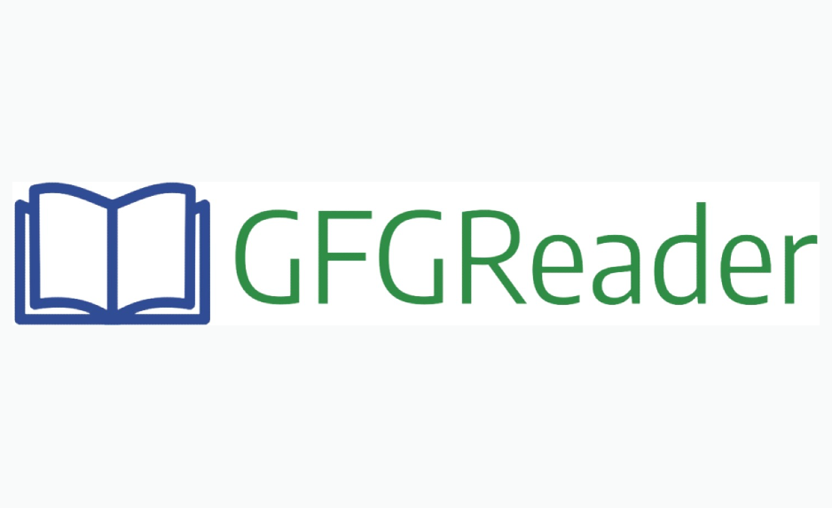

Distraction-Free Reading for Geeksforgeeks

# GFGReader

## Description

GFGReader is a Chrome extension designed to provide a distraction-free reading experience for Geeksforgeeks blogs. Say goodbye to cluttered UI and distractions – with GFGReader, you can focus solely on the content that matters.

## Features

- Hides unnecessary elements such as suggestions and promotions
- Optimizes background color and layout for comfortable reading
- Seamlessly integrates with Geeksforgeeks website

## How to Use

1. Install the extension from the Chrome Web Store.
2. Visit any Geeksforgeeks blog page.
3. Enjoy an optimized reading experience without distractions.

## Screenshots

### Before using extension

 

### After using extension

## Installation

You can install the extension directly from the Chrome Web Store link will be provided soon.

## Contribution

Contributions are welcome! If you find any issues or have suggestions for improvements, please feel free to open an issue or submit a pull request.

## License

This extension is licensed under the [MIT License](license-link).

## Author

- **Dhruv Mishra**
